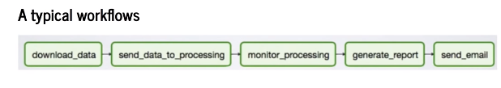
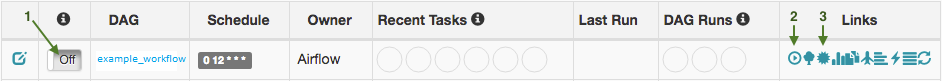

# Apache Airflow

Having an adaptive, efficient and robust ETL (extract, transform, load) processes are the key in creating highly available quality data.

In this blog, I will provide a quick overview of the Apache Airflow framework where a team can create maintainable, versionable and testable code to fine tune the performance of the ETL processes.

# Let's go!

## What is Apache Airflow?

Apache Airflow (or simply Airflow) is an open source framework which allows one to configure, schedule and monitor data pipelines programmatically in Python.

An Airflow workflow is designed as a directed acyclic graph (DAG). 

A DAG can be described as a division of tasks which are executed independently.

A Workflow is either scheduled or triggered by an event.



Figure 1:  Workflow example

In figure 1, the workflow will perform following tasks:

1) Download the data from a single or various sources
2) Send the data to be processed
3) Monitor process till completion
4) Retrieve the results and generate the report(s)
5) Email the report(s)

## DAG - The basics

Example DAG snippet:

```python

# Define DAG
DAG = DAG(
    dag_id='example_workflow',
    description='Example workflow code',
    schedule_interval='0 12 * * *',
    start_dat=datetime.now()
)

# Define operators
download_data = PythonOperator(
    task_id='download_data_task',
    python_callable=get_data,
    retries=3,
    dag=dag,
)

send_data_to_processing = PythonOperator(
    task_id='send_data_to_processing_task',
    python_callable=send_data,
    retries=5,
    dag=dag,
)

monitor_processsing = DummyOperator(
    task_id='monitor_processsing_task',
    dag=dag,
)

generate_report = PythonOperator(
    task_id='generate_report_task',
    python_callable=get_report,
    dag=dag,
)

send_email = PythonOperator(
    task_id='send_email_task',
    python_callable=send_report,
    dag=dag,
)

# Define order
download_data >> send_data_to_processing >> monitor_processsing >> generate_report >> send_email
```
NOTE: When designing Airflow operators, it’s important to keep in mind that they may be executed more than once. therefore should be atomic.

The above DAG snippet creates five operators: one DummyOperator (does nothing) and four PythonOperator which calls their defined methods when the task is executed

For more information on operators, see appendix two.

# Conclusion

ETL processes are plagued by inefficiencies, resulting in failed tasks leading to operational downtime.  In this blog, the Apache Airflow framework was presented as a solution in creating, monitoring and scaling these critical data pipelines.

---

Appendix One: Quick start Airflow on Linux

## Airflow Installation

1) Create airflow folder where DAG definition files and Airflow plugins will be stored

```$ mkdir airflow```

2) Set the AIRFLOW_HOME environment variable

```$ export AIRFLOW_HOME=<PATH>/airflow```

3) Use pip to install airflow

```$ pip install apache-airflow```

NOTE: On November 2020, new version of PIP (20.3) has been released with a new, 2020 resolver. This resolver does not yet work with Apache Airflow and might leads to errors in installation - depends on your choice of extras. In order to install Airflow you need to either downgrade pip to version 20.2.4 pip upgrade --pip==20.2.4 or, in case you use Pip 20.3, you need to add option --use-deprecated legacy-resolver to your pip install command.

4) Initialize the database

```$ airflow db init```

```
$ airflow users create \
    --username admin \
    --firstname Michael \
    --lastname Yee \
    --role Admin \
    --email michael.yee@gmail.com
```

5) Start the web server

```$ airflow webserver --port 8080```

6) Start the scheduler

```$ airflow scheduler```

Folder structure

```
airflow
├── airflow.cfg
├── airflow.db
├── dags                     <- DAGs directory
│   └── example_workflow.py  <- DAG definition file
│   └── operators.py         <- DAG definition file
├── plugins
│   └── plugins.py           <- Plugin file
└── unittests.cfg
```

## Running your DAG

In order to run your DAG, start the Airflow scheduler by issuing the following command

```$ airflow scheduler```

The scheduler will send tasks for execution. The default Airflow settings rely on an executor named SequentialExecutor, which is started automatically by the scheduler. In production you would probably want to use a more robust executor, such as the CeleryExecutor.

## Debugging an Airflow operator

To manually start a single operator in the context of a specific DAG run, use the `airflow test` command. 

This command takes 3 arguments: the name of the dag, the name of a task and a date associated with a particular DAG Run.

```$ airflow test my_test_dag my_first_operator_task 2017-03-18T18:00:00.0```

## Airflow UI

Nagivate to the Airflow UI in your browser, you should see a listed of DAGs in the Airflow UI.



Figure 2: Airflow UI

In order to start a DAG Run, first turn the workflow on (arrow 1), then click the Trigger Dag button (arrow 2) and finally, click on the Graph View (arrow 3) to see the progress of the run.

---

Appendix Two: Operators (https://airflow.apache.org/docs/apache-airflow/stable/concepts.html#operators)

DAGs describe how to run a workflow -> ensures that operators run in the correct order.

Operators determine what actually gets done by a task => describes a single atomic task.

Airflow provides many built-in operators for many common tasks, several of the more common operators are as follows:

- BashOperator: Execute a Bash script, command or set of commands
- EmailOperator: Sends an email
- MySqlOperator: Executes sql code in a specific MySQL database
- PythonOperator:  Executes a Python callable
- S3FileTransformOperator: Copies data from a source S3 location to a temporary location on the local filesystem. Runs a transformation on this file as specified by the transformation script and uploads the output to a destination S3 location.
- SimpleHttpOperator: Calls an endpoint on an HTTP system to execute an action
- SlackAPIOperator: Base Slack Operator The SlackAPIPostOperator is derived from this operator
