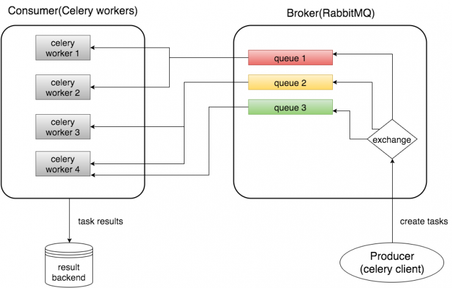

# Overview

In this blog, I will introduce various concepts of Celery with RabbitMQ and then set up a simple Celery project. 

# Celery - distributed task queue

Celery is a simple, flexible, and reliable distributed system to process vast amounts of messages, while providing operations with the tools required to maintain such a system.

It’s a task queue with focus on real-time processing, while also supporting task scheduling.

## Install Celery

    pip install celery

# RabbitMQ - message broker

RabbitMQ is a message-queueing software called a message broker or queue manager. Simply said; It is a software where queues can be defined, applications may connect to the queue and transfer a message onto it. 

A message can include any kind of information. It could, for example, have information about a process/task that should start on another application (that could be on another server), or it could be just a simple text message. The queue-manager software stores the messages until a receiving application connects and takes a message off the queue. The receiving application then processes the message in an appropriate manner. 


## RabbitMQ image: rabbitmq:3.7.7-management-alpine

To simplify the project, we will run the latest official RabbitMQ management image.

Running the daemon

    docker run -d --hostname my-rabbit --name innovation-rabbit rabbitmq:3.7.7-management-alpine


# Basic concepts



## Producer

A producer is a user application that sends messages to the broker.

## Broker

A broker (RabbitMQ in our case) receives messages from producer and router them to consume. A broker consists an exchange and one or more queues.

## Exchange

A producer can send messages to queues only via exchange. Exchanges take a message from producer and route it into zero or more queues. The routing algorithm used depends on the exchange type and rules called bindings.

## Queue

A message or task queue is a buffer that stores messages.

## Bindings

Bindings are rules that the exchange uses to route messages to queues.

## Routing Keys

Bindings may have an optional routing key attribute. An exchange may use this field to route a message to the bound queue.

## Consumer

The Consumer is the one or multiple Celery workers executing the tasks. You could start many workers depending on your use case.

# Celery project

## Structure

+--parent
|  +--proj
|  |  +--__init__.py
|  |  +--celery.py
|  |  +--celeryconfig.py
|  |  +--tasks.py
|  |  +--run_tasks.py

## celery.py

We initialize an instance of Celery called app, which is used later for creating a task.
The first argument of Celery is just the name of the project package, which is "proj".
Then we load the remainder of Celery's configuration from "celeryconfig".

```python
from celery import Celery


app = Celery('proj')
app.config_from_object('proj.celeryconfig')


if __name__ == '__main__':
    app.start()

```

## celeryconfig.py

The broker_url setting specifies the transport (amqp) and IP to RabbitMQ.
The result_backend setting specifies to send results back as AMQP messages.  If you do not require any results, you can remove this setting.
The imports setting specifies a list of modules that you want to import when Celery worker starts. We add the tasks module here so that the worker can find our task.
The task_routes setting specifies the router(s) used to route tasks to queues.

```python
# Celery queues names
A_QUEUE = 'add_queue'
M_QUEUE = 'mul_queue'


# Broker settings
broker_url = 'amqp://172.17.0.2'
result_backend = 'rpc://'
imports = ['proj.tasks']
task_routes = {'proj.tasks.add': {'queue': A_QUEUE, 'routing_key': A_QUEUE}, 'proj.tasks.mul': {'queue': M_QUEUE, 'routing_key': M_QUEUE}}

```

## tasks.py:

You can see that we import the app defined in celery.py and use it as a decorator for our task methods. In addition, we sleep 5 seconds in our mul funciton to simulate a time-expensive task.

```python
from proj.celery import app
from proj.celeryconfig import A_QUEUE, M_QUEUE
import time


@app.task(bind=True, name='proj.tasks.add', queue=A_QUEUE, default_retry_delay=1, max_retries=3)
def add(self, x, y):
    try:
        print(x+y)
        return x + y
    except Exception as exc:
        raise self.retry(exc=exc)


@app.task(name='proj.tasks.mul', queue=M_QUEUE)
def mul(x, y):
    print('Long running task begins')
    # sleep 5 seconds
    time.sleep(5)
    print(f'Long running task finished with result {x*y}')
    return x * y

```

## run_tasks.py

We call the task add using the apply_async method and task mul using the delay method, which is needed if we want to process the task asynchronously. In addition, we keep the results of the tasks and print their information. The ready method will return True if the task has been finished, otherwise False. The result attribute is the result of the task. If the task has not been finished, it returns None.

````python
from  proj.tasks import add, mul
from proj.celeryconfig import A_QUEUE, M_QUEUE
import time


if __name__ == '__main__':
    add_result = add.apply_async((2, 2), queue=A_QUEUE)
    # sleep 1 seconds to ensure the task has been finished
    time.sleep(1)
    # now the task should be finished and ready method will return True
    print(f'add task finished? {add_result.ready()}')
    print(f'add task result: {add_result.result}')

    mul_result = mul.delay(3, 3)
    # at this time, our task is not finished, so it will return False
    print(f'mul task finished? {mul_result.ready()}')
    print(f'mul task result: {mul_result.result}')
    # sleep 10 seconds to ensure the task has been finished
    time.sleep(10)
    # now the task should be finished and ready method will return True
    print(f'mul task finished? {mul_result.ready()}')
    print(f'mul task result: {mul_result.result}')
    
````

## Start Celery Worker

Now, we can start Celery worker using the command below (run in the parent folder of our project folder "proj"):

    celery -A proj worker --loglevel=info -Q add_queue,mul_queue

 You should see something similar if Celery successfully connects to RabbitMQ:

     -------------- celery@michael-ASUS v4.2.1 (windowlicker)
    ---- **** ----- 
    --- * ***  * -- Linux-4.4.0-134-generic-x86_64-with-debian-stretch-sid 2018-09-20 21:28:00
    -- * - **** --- 
    - ** ---------- [config]
    - ** ---------- .> app:         proj:0x7efc0abf29e8
    - ** ---------- .> transport:   amqp://guest:**@172.17.0.2:5672//
    - ** ---------- .> results:     disabled://
    - *** --- * --- .> concurrency: 4 (prefork)
    -- ******* ---- .> task events: OFF (enable -E to monitor tasks in this worker)
    --- ***** ----- 
     -------------- [queues]
                    .> add_queue        exchange=add_queue(direct) key=add_queue
                    .> mul_queue        exchange=mul_queue(direct) key=mul_queue

    [tasks]
      . proj.tasks.add
      . proj.tasks.mul

    [2018-09-20 21:28:00,934: INFO/MainProcess] Connected to amqp://guest:**@172.17.0.2:5672//
    [2018-09-20 21:28:00,942: INFO/MainProcess] mingle: searching for neighbors
    [2018-09-20 21:28:01,959: INFO/MainProcess] mingle: all alone
    [2018-09-20 21:28:01,974: INFO/MainProcess] celery@michael-ASUS ready.

## Running the tasks

In another terminal, 

    python -m proj.run_tasks

In the Celery console, you will see that our worker received the task:

    [2018-09-20 22:04:40,974: INFO/MainProcess] Received task: proj.tasks.add[ada72f01-36ef-45dc-b56d-f8ae0ed66460]  
    [2018-09-20 22:04:40,975: WARNING/ForkPoolWorker-2] 4
    [2018-09-20 22:04:40,985: INFO/ForkPoolWorker-2] Task proj.tasks.add[ada72f01-36ef-45dc-b56d-f8ae0ed66460] succeeded in 0.010188293999817688s: 4
    [2018-09-20 22:04:41,984: INFO/MainProcess] Received task: proj.tasks.mul[00211d52-4a04-4df1-a26d-50bf320ed12c]  
    [2018-09-20 22:04:41,986: WARNING/ForkPoolWorker-1] Long running task begins
    [2018-09-20 22:04:46,992: WARNING/ForkPoolWorker-1] Long running task finished with result 9
    [2018-09-20 22:04:47,002: INFO/ForkPoolWorker-1] Task proj.tasks.mul[00211d52-4a04-4df1-a26d-50bf320ed12c] succeeded in 5.0155906579993825s: 9

As you can see, when our Celery worker received a task, it printed out the task name with a task id (in the bracket):

    Received task: proj.tasks.mul[00211d52-4a04-4df1-a26d-50bf320ed12c]

Below this line are two lines that were printed by our task mul, with a time delay of 5 seconds:

    Long running task begins
    Long running task finished with result 9

The last line shows that our task was finished in about 5 seconds and the task result is 9:

    Task proj.tasks.mul[00211d52-4a04-4df1-a26d-50bf320ed12c] succeeded in 5.0155906579993825s: 9

In the current console, you will see the following output:

    proj.run_tasks
    add task finished? True
    add task result: 4
    mul task finished? False
    mul task result: None
    mul task finished? True
    mul task result: 9


# Conclusion

Celery is easy to set up when used with the RabbitMQ broker.

---

# Additional information:

## Monitor Celery in Real Time

Flower is a real-time web-based monitor for Celery. Using Flower, you could easily monitor your task progress and history.

Install Flower
    
    pip install flower

To start the Flower web console, we need to run the following command (run in the parent folder of our project folder "proj"):

    celery -A proj flower

Flower will run a server with default port 5555, and you can access the web console at http://localhost:5555.

## The more Queues the merrier

Celery is fairly simple to set up and it comes with a default queue in which it puts all the tasks unless you tell it otherwise. Fire and forget right?  But, what happens if we have a senarios where task_A takes much much longer thanks task_B or task_A is much more vital than task_B?

So why throw them both in the same queue? Even if you've got just one worker processing both tasks, suppose that at some point the unimportant task_B gets so massive in numbers that the more important taks_A just can't get enough attention from the worker? At this point increasing the number of workers will probably not solve your problem as all workers still need to process both tasks, and with task_B so great in numbers task_A still can't get the attention it deserves.

The way to solve the issue above is to have task_A in one queue, and task_B in another and then assign x workers to process queue_B and all the other workers to process the more intensive queue_A as it has more tasks coming in. This way you can still make sure that task_B gets enough workers all the while maintaining a few priority workers that just need to process task_A when one comes in without making it wait to long on processing.

## If at first you don't succeed, Try, try, try again

There are many cases where a task will fail.  This might be fine for some use cases, however, most tasks I've seen are talking to some kind of 3rd party API and fail because of some sort of network error or other kind of "resource availability" error.  A simple way we can handle these kinds of errors is to just retry the task.

The following example defines for how long should a task wait before being retried and how many retries is enough before finally giving up (the default_retry_delay and max_retries parameters respectively). This is the most basic form of error handling and more people should use it. 
