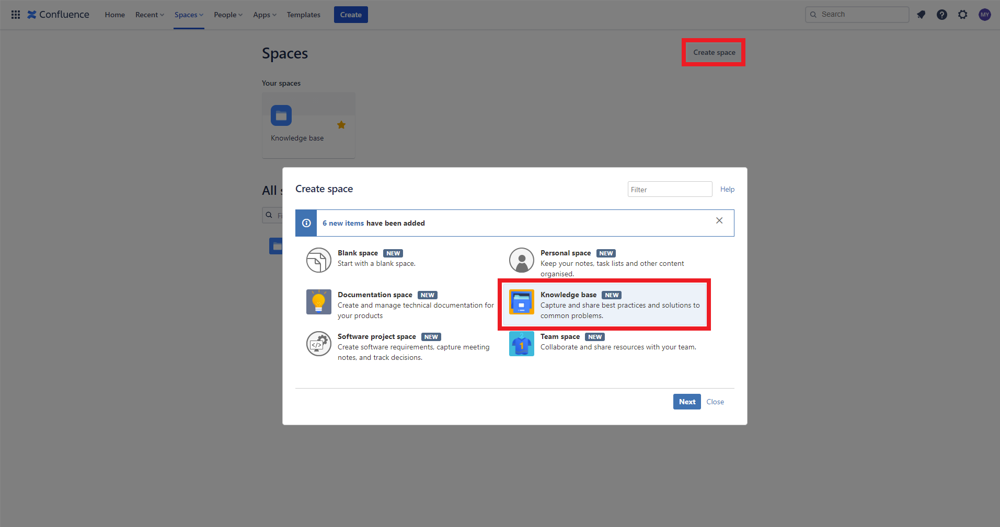
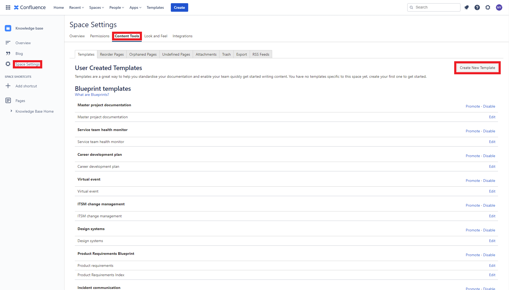
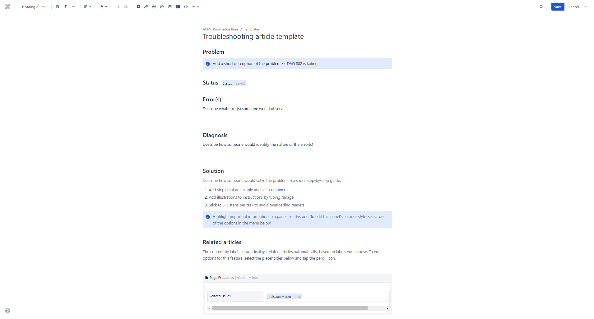
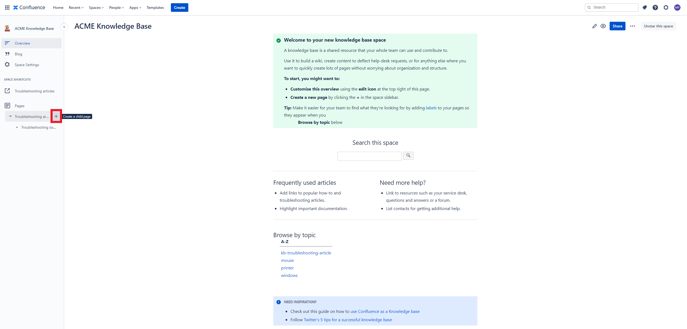
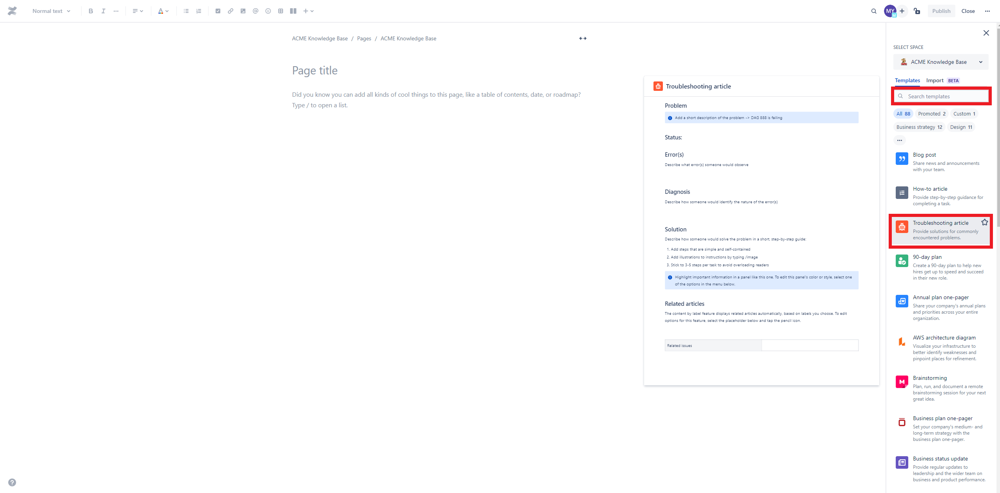
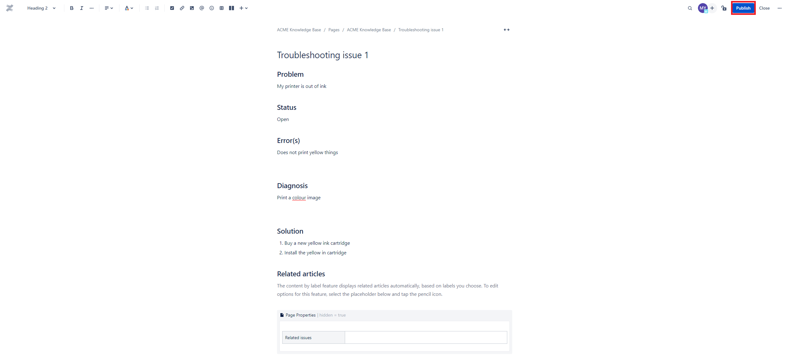
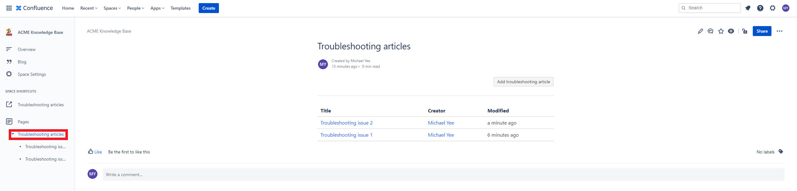
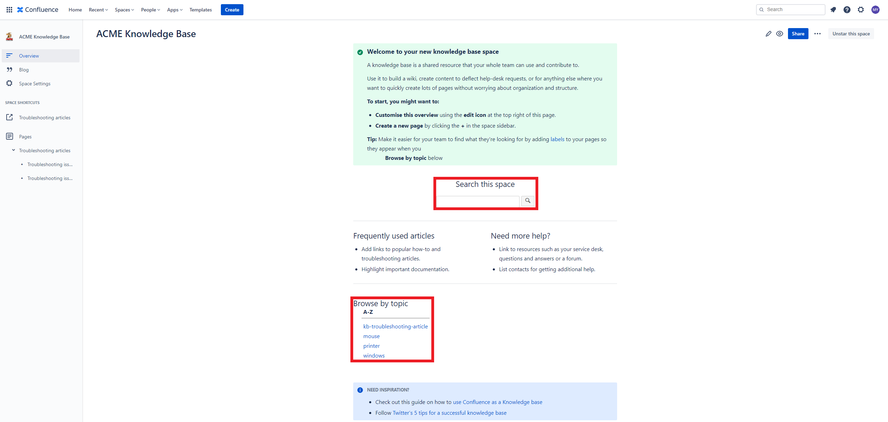
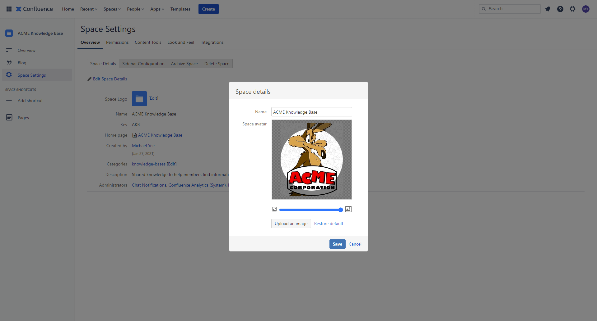

# How to create a knowledge base using Confluence

A well written, maintained and accessible knowledge base should be the cornerstone of any group’s self-service strategy.

In this blog, I will explain how to create a knowledge base using Confluence.

# Let's go!

## Space creation

In Confluence, create a new Space called `knowledge base`. 

## Template creation

1. Go to `Space Setting` on the Confluence sidebar
2. Select `Content Tools`
3. In the User Created Templates section, click on Create New Template.

4. Create the following templated name `Troubleshooting article template`

NOTE: See appendix ONE: Instructional text and TWO: Template variables

5. Make sure you promote the template so everyone will use it

## Create Troubleshooting article

1. Select the `+` button next to Troubleshooting articles

2. Select the Troubleshooting template

NOTE: If you do not see the Troubleshooting template, search for it in the search box

3. Fill in the template and select `Publish`

## Searching for troubleshooing articles

1. Select the `Troubleshooting articles` and new the list of titles

2. Main Space page `search this space` or `browse by topic`

---

Appendix ONE: Instructional text

Instructional text is placeholder content in a template, and is only visible while you're editing the page. Use it to give guidance to whoever is creating a page from the template.

To insert instructional text:

Choose Template > Instructional Text in the toolbar

Type in your instructional text (for example, Insert an image of the interface here.)
Instructional text appears in italics with a shaded background, to distinguish it from normal paragraph text.

You can also change the placeholder type from Text to either:

* User mention – Opens the user mention dialog.
* Jira Macro – Opens a dialog that allows you to create a new Jira issue, or search for one or more Jira issues to include on the page.

Appendix TWO: Template variables

When you add variables to your template, they will act as form fields. When you create a page based on a template, you'll see a text entry box for each field. Enter data into each field, and it'll be added to the page.

You can add the same variable more than once in the same template, which is useful if you need the same information in more than one place on the page.

To insert a variable into a template:

1. Choose Template > New Variable from the editor toolbar (or choose an existing variable to add it to the page)
2. Enter a name for the variable
3. Press Enter (by default this will create a single-line text input field)
4. To change the variable type, click the variable placeholder and the variable's property panel will appear. Choose one of the variable types: Text, Multi-line Text, or List.

You can change the number of lines and width in characters of a Multi-line Text field. If you choose List, enter each of the items in your list, separated by commas.

Appendix THREE: Customize your knowledge base space

### Space logo

1. Go to `Space Setting` on the Confluence sidebar
2. Select `Space Details`
3. Click on `Edit`
4. Upload an image
5. Click on `Save`

