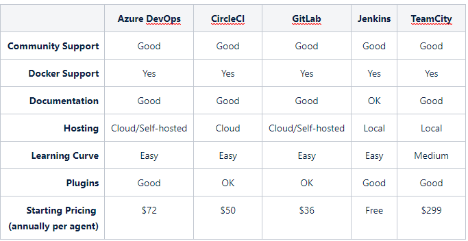

# Overview

In this blog, I will perform a general evaluation on five popular .net core friendly continuous integration tools.  The evaluation will be based on the following criteria:  

* Community Support
* Docker Support
* Documentation
* Hosting
* Learning Curve
* Plugins
* Pricing

## Background

Continuous integration (CI) is a software development practice of automating the integration of code continuously. 

Verification steps are included to ensure the quality of the code and that the new code performs as expected. 

Using this practice, instantaneous pass/fail code modification feedback is given to the software development team.

## Let's start!

How do you choose a continuous integration tool?

I have select several criteria that would best fit most DevOps requirements as follows:

Community Support, documentation and plugins
CI tool with understandable documentation and a decent size open-source community (i.e. plugin development)

Docker support
Container are a popular way of deploying applications, ensure the CI tool has support to connect to the target environment for end to end testing

Hosting
While self-hosted CI tools benefit from initial cost savings and flexibility, managed cloud tools spare the setup hardships offering greater scalability

Learning curve
If it is too hard to learn no one is going to use it

Pricing
Who said money is no object?

### Azure DevOps

Pros:

* Build for .net core projects
* Many pre-configured pipelines for .net core project
* Supports a wide variety of version control systems, programming languages, and deployment targets
* Tailored for Microsoft products integration (i.e. Visual Studio)

Cons:

* Initial time investment for CI projects
* Tailored for Microsoft products integration (i.e. Visual Studio)

### CircleCI

Pros:
* Customer support
* Debugging via SSH
* Intuitive UI
* Integrates flawlessly with leading cloud platforms

Cons: 
* Excessive CI automation
* Windows OS builds and testing are not available

### GitLab CI

Pros:
* GitLab CI's code is open source and under the MIT license
* Scalability for performance testing
* Simple UI

Cons:
* Does not directly support Windows base builds or testing
* GitLabs as your Git system
* CPU and memory pig
* Self-hosted runners

### Jenkins

Pros:

* Distribution of builds and test loads
* Free
* Huge active community and plugins 
* Integrate to any external application
* Self-host of client and server

Cons:

* Documentation is insufficient
* No direct integration with .NET Core
* Self-host of client and server
* UI is not intuitive

### Teamcity

Pros:

* Configuration for .NET Core
* Easy to set up and functional after installation
* Great out of the box support for tool versioning, framework testing, code coverage and code analysis
* User guide is easily understood

Cons:

* Complex UI and initially overwhelming in building CI projects
* Sever maintenance

## Conclusion

In this blog, I have listed a variety of pros and cons for five continuous integration tools.

The following table summarizes criteria that would best fit most DevOps requirements for the five continuous integration tools.

