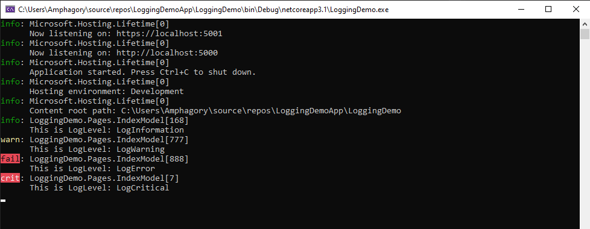

# Overview

In this blog, I will explore the default logging provided in .NET Core 3.x. We will examine what is included in the default logging and how to use it effectively.

## Why use logging?

Logging is primary used for debugging and monitoring your application. Logging occurs synchronously within your application.

Note:  Logging is not meant to capture critical information.  Logging does not guarantee all the logging events will be captured. 

## Logging providers

Logging providers store logs, except for the Console provider which displays logs. For example, the Azure Application Insights provider stores logs in Azure Application Insights.

NOTE: Default logging providers: Console, Debug EventSource and EventLog (Windows only)

# Getting started

First create an ASP.NET Core Web Application and open the file index.cshtml.cs as shown below:


In this file, you will see the class IndexModel which uses an ILogger<TCategoryName> object from dependency injection (DI) to create a logger. This will be our starting point of our exploration.

Code snippet: index.cshtml.cs => ILogger

```csharp
public class IndexModel : PageModel
{
    private readonly ILogger<IndexModel> _logger;

    public IndexModel(ILogger<IndexModel> logger)
    {
        _logger = logger;
    }

    public void OnGet()
    {

    }
}
```

## How do I configure the default logging?

Logging is configured within the CreateDefaultBuilder

Code snippet: Program.cs => CreateDefaultBuilder

```csharp
public class Program
{
    public static void Main(string[] args)
    {
        CreateHostBuilder(args).Build().Run();
    }

    public static IHostBuilder CreateHostBuilder(string[] args) =>
        Host.CreateDefaultBuilder(args)
            .ConfigureWebHostDefaults(webBuilder =>
            {
                webBuilder.UseStartup<Startup>();
            });
}
```

If you press F12 on CreateDefaultBuilder to get its definition and expand out its comment, you will see a bunch of remarks.  The one we are interested in is as following:

Code snippet: Microsoft.Extensions.Hosting => CreateDefaultBuilder

```csharp
// configure the Microsoft.Extensions.Logging.ILoggerFactory to log to the console, debug, and event source output
```

From the remark above, default logging will be outputted to console, debug, and event source.

## What logging is produced out of the box?

Let's see what logging is produced out of the box? Simply launch the app by its name and NOT by IIS Express (console will not pop up if you launch it using IIS Express).  You should see something similar as follows:


In the console, you will see information event logs.
In the Visual Studio output window, you will see debug event logs.

The information in debug event has more detailed than information events.

## How do I override the default set of the logging providers?

To define the set of logging providers, one needs to chain the action ConfigureLogging to CreateDefaultBuilder.  The following code snippet will remove all logging instances, load the logging configurartion options from appsettings.json and add Consle and Debug logging providers:

Code snippet: Program.cs => CreateDefaultBuilder


```csharp
public class Program
    {
        public static void Main(string[] args)
        {
            CreateHostBuilder(args).Build().Run();
        }

        public static IHostBuilder CreateHostBuilder(string[] args) =>
            Host.CreateDefaultBuilder(args)
                .ConfigureLogging((context, logging) =>
                {
                    // Removes all listeners of logging events
                    logging.ClearProviders();

                    // Confugures logging options -> options defined in appsettings.json
                    logging.AddConfiguration(context.Configuration.GetSection("Logging"));

                    // Adding Console and Debug loggers
                    logging.AddConsole();
                    logging.AddDebug();

                })
                .ConfigureWebHostDefaults(webBuilder =>
                {
                    webBuilder.UseStartup<Startup>();
                });
    }
```

## How do I configure logging options?

Logging configuration is commonly provided by the Logging section of appsettings.{Environment}.json files. The following appsettings.Development.json file is generated by the ASP.NET Core web app templates:

Code snippet: appsettings.cs => Logging

```json
{
  "Logging": {
    "LogLevel": {
      "Default": "Information",
      "Microsoft": "Warning",
      "Microsoft.Hosting.Lifetime": "Information"
    }
  },
  "AllowedHosts": "*"
}
```

In the preceding JSON:

* The "Default", "Microsoft", and "Microsoft.Hosting.Lifetime" categories are specified.
* The "Microsoft" category applies to all categories that start with "Microsoft". For example, this setting applies to the "Microsoft.AspNetCore.Routing.EndpointMiddleware" category.
* The "Microsoft" category logs at log level Warning and higher.
* The "Microsoft.Hosting.Lifetime" category is more specific than the "Microsoft" category, so the "Microsoft.Hosting.Lifetime" category logs at log level "Information" and higher.
* A specific log provider is not specified, so LogLevel applies to all the enabled logging providers except for the Windows EventLog.

Note: If one wanted "Microsoft" to have all the save Loglevels, simply use a wildcard as follows:

Code snippet: appsettings.cs => Logging

```json
{
  "Logging": {
    "LogLevel": {
      "Default": "Information",
      "Microsoft*": "Warning",
    }
  },
  "AllowedHosts": "*"
}
```

The Logging property can have LogLevel and log provider properties. The LogLevel specifies the minimum level to log for selected categories. In the preceding JSON, Information and Warning log levels are specified. LogLevel indicates the severity of the log and ranges from 0 to 6:

Trace = 0, Debug = 1, Information = 2, Warning = 3, Error = 4, Critical = 5, and None = 6.

When a LogLevel is specified, logging is enabled for messages at the specified level and higher. In the preceding JSON, the Default category is logged for Information and higher. For example, Information, Warning, Error, and Critical messages are logged. If no LogLevel is specified, logging defaults to the Information level. 

A provider property can specify a LogLevel property. LogLevel under a provider specifies levels to log for that provider, and overrides the non-provider log settings. Consider the following appsettings.json file:

Code snippet: appsettings.cs => Logging

```json
{
  "Logging": {
    "LogLevel": { // All providers, LogLevel applies to all the enabled providers.
      "Default": "Error", // Default logging, Error and higher.
      "Microsoft": "Warning" // All Microsoft* categories, Warning and higher.
    },
    "Console": { // Console provider
      "LogLevel": {
        "Default": "Warning" // All categories of Console provider.
      }
    },    
    "Debug": { // Debug provider.
      "LogLevel": {
        "Default": "Information", // Overrides preceding LogLevel:Default setting.
        "Microsoft.Hosting": "Trace" // Debug:Microsoft.Hosting category.
      }
    }
  }
}
```

## How do I log different LogLevels?

The following snippet of code will demostrate how to perfrom logging @ with different LogLevels.

Code snippet: index.cshtml.cs

```csharp
public class IndexModel : PageModel
{
    private readonly ILogger<IndexModel> _logger;

    public IndexModel(ILogger<IndexModel> logger)
    {
        _logger = logger;
    }

    public void OnGet()
    {
        // Logging LogLevel
        _logger.LogTrace(LoggingEventID.APIFailure, "This is LogLevel: LogTrace");
        _logger.LogDebug(LoggingEventID.CPUFailure, "This is LogLevel: LogDebug");
        _logger.LogInformation(LoggingEventID.DatabaseFailure, "This is LogLevel: LogInformation");
        _logger.LogWarning(LoggingEventID.HardDriveFailure, "This is LogLevel: LogWarning");
        _logger.LogError(LoggingEventID.MemoryFailure, "This is LogLevel: LogError");
        _logger.LogCritical(LoggingEventID.APIFailure, "This is LogLevel: LogCritical");
    }

    // Example class for EventID
    public class LoggingEventID
    {
        public const int APIFailure = 7;
        public const int CPUFailure = 8;
        public const int DatabaseFailure = 168;
        public const int HardDriveFailure = 777;
        public const int MemoryFailure = 888;
    }
}

```

NOTE: The EventID is not a necessary argument

The consle output is as follows:



Notice, we only have three of the six logs outputted to console.  The reasons for this is that we have set the minimal log level to INFO.

## Can I use string interpolation in my log messages?

```_logger.LogInformation(LoggingEventID.DatabaseFailure, "{DateTime} - This is LogLevel: LogInformation", DateTime.UtcNow);```

vs

```_logger.LogInformation(LoggingEventID.DatabaseFailure, $"{DateTime}This is LogLevel: LogInformation");```

If you are using semantic or structural logging frameworks, it prefers the non string interpolation format to grab the arguement(s) and store them in a separate location/object to display the log message.

# Resources

* [Logging in .NET Core and ASP.NET Core](https://docs.microsoft.com/en-us/aspnet/core/fundamentals/logging/?view=aspnetcore-5.0)

# Next steps

* Serilog is a diagnostic logging library for .NET applications. It is easy to set up, has a clean API, and runs on all recent .NET platforms. While it's useful even in the simplest applications, Serilog's support for structured logging shines when instrumenting complex, distributed, and asynchronous applications and systems.

    * Serilog and Azure Blob Storage

*  Application Insights, a feature of Azure Monitor, is an extensible Application Performance Management (APM) service for developers and DevOps professionals. Use it to monitor your live applications. It will automatically detect performance anomalies, and includes powerful analytics tools to help you diagnose issues and to understand what users actually do with your app. It's designed to help you continuously improve performance and usability. It works for apps on a wide variety of platforms including .NET, Node.js, Java, and Python hosted on-premises, hybrid, or any public cloud. It integrates with your DevOps process, and has connection points to a variety of development tools. It can monitor and analyze telemetry from mobile apps by integrating with Visual Studio App Center.
