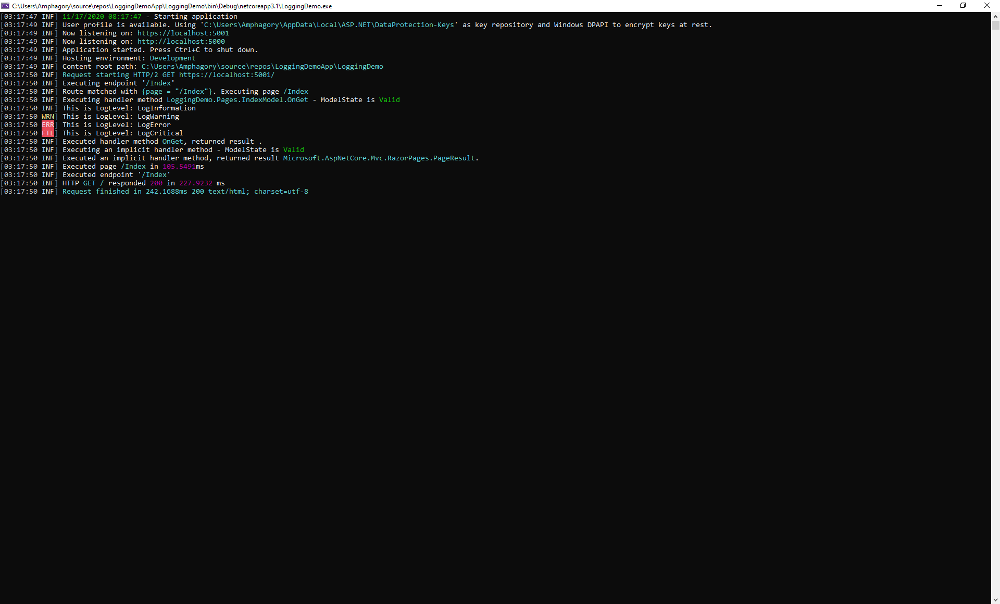

# Overview

In this blog, I will explore logging with Serilog in .NET Core 3.x. We will examine Serilog and how to use it effectively.

## Why use logging?

Logging is primary used for debugging and monitoring your application. Logging occurs synchronously within your application.

Note:  Logging is not meant to capture critical information.  Logging does not guarantee all the logging events will be captured. 

## What is Serilog?

Serilog is a diagnostic logging library for .NET applications. It is easy to set up, has a clean API, and runs on all recent .NET platforms. While it's useful even in the simplest applications, Serilog's support for structured logging shines when instrumenting complex, distributed, and asynchronous applications and systems.

In this blog, we will setup Serilog as a logging providers to store logs.

## Install Serilog packages

In the NuGet Package Manager, browse for the package serilog.aspnetcore and select install as shown below:


In the NuGet Package Manager, browse for the package serilog.settings.configuration and select install as shown below:


In the NuGet Package Manager, browse for the package serilog.enrichers.environment, serilog.enrichers.thread and serilog.enrichers.process and select install as shown below:


# Getting started

First create an ASP.NET Core Web Application and open the file index.cshtml.cs as shown below:


In this file, you will see the class IndexModel which uses an ILogger<TCategoryName> object from dependency injection (DI) to create a logger. This will be our starting point of our exploration.

Code snippet: index.cshtml.cs => ILogger

```csharp
public class IndexModel : PageModel
{
    private readonly ILogger<IndexModel> _logger;

    public IndexModel(ILogger<IndexModel> logger)
    {
        _logger = logger;
    }

    public void OnGet()
    {

    }
}
```

## How do I configure the default logging?

Logging is configured within the CreateDefaultBuilder

Code snippet: Program.cs => CreateDefaultBuilder

```csharp
public class Program
{
    public static void Main(string[] args)
    {
        CreateHostBuilder(args).Build().Run();
    }

    public static IHostBuilder CreateHostBuilder(string[] args) =>
        Host.CreateDefaultBuilder(args)
            .ConfigureWebHostDefaults(webBuilder =>
            {
                webBuilder.UseStartup<Startup>();
            });
}
```

If you press F12 on CreateDefaultBuilder to get its definition and expand out its comment, you will see a bunch of remarks.  The one we are interested in is as following:

Code snippet: Microsoft.Extensions.Hosting => CreateDefaultBuilder

```csharp
// configure the Microsoft.Extensions.Logging.ILoggerFactory to log to the console, debug, and event source output
```

From the remark above, default logging will be outputted to console, debug, and event source.

## What logging is produced out of the box?

Let's see what logging is produced out of the box? Simply launch the app by its name and NOT by IIS Express (console will not pop up if you launch it using IIS Express).  You should see something similar as follows:


In the console, you will see information event logs.
In the Visual Studio output window, you will see debug event logs.

The information in debug event has more detailed than information events.

## Where are the logging configure options stored?

Logging configuration is commonly provided by the Logging section of appsettings.json files. The following appsettings.json file is generated by the ASP.NET Core web app templates:

JSON: appsettings.cs

```json
{
  "Logging": {
    "LogLevel": {
      "Default": "Information",
      "Microsoft": "Warning",
      "Microsoft.Hosting.Lifetime": "Information"
    }
  },
  "AllowedHosts": "*"
}
```

## How do I override the default set of the logging providers to user Serilog?

The following code will set our logging provider to Serilog and configure its settings via appsettings.cs:

Code: Program.cs

```csharp
using System;
using System.Collections.Generic;
using System.Linq;
using System.Threading.Tasks;
using Microsoft.AspNetCore.Hosting;
using Microsoft.Extensions.Configuration;
using Microsoft.Extensions.Hosting;
using Microsoft.Extensions.Logging;
using Serilog;

namespace LoggingDemo
{
    public class Program
    {
        public static void Main(string[] args)
        {
            // Configures logging options -> options defined in appsettings.json
            var configuration = new ConfigurationBuilder()
                .AddJsonFile("appsettings.json")
                .Build();

            // Create Logger
            Log.Logger = new LoggerConfiguration()
                .ReadFrom.Configuration(configuration)
                .CreateLogger();

            try
            {
                Log.Information("{DateTime} - Starting application", DateTime.UtcNow);
                CreateHostBuilder(args).Build().Run();
            }
            catch (Exception ex)
            {

                Log.Fatal(ex, "{DateTime} - Failed to start application", DateTime.UtcNow);
            }
            finally
            {
                // Writes any remaining event logs and disposes the logging provider
                Log.CloseAndFlush();
            }
        }

        public static IHostBuilder CreateHostBuilder(string[] args)
        {
            return Host.CreateDefaultBuilder(args)
                // Set Serilog as our default logging provider
                .UseSerilog()
                .ConfigureWebHostDefaults(webBuilder =>
                {
                    webBuilder.UseStartup<Startup>();
                });
        }
    }
}
```

JSON: appsettings.cs

```json
{
  "AllowedHosts": "*",
  "Serilog": {
    "Using": [],
    "MinimumLevel": "Information",
    "Override": {
      "Microsoft": "Warning",
      "System": "Warning"
    },
    "Enrich": [ "FromLogContext", "WithMachineName", "WithProcessId", "WithThreadId" ],
    "WriteTo": [
      {
        "Name": "Console"
      },
      {
        "Name": "File",
        "Args": {
          "path": "D:\\logs\\log.txt",
          "outputTemplate": "{Timestamp:G} {Message}{NewLine:1}{Exception:1}"
        }
      },
      {
        "Name": "File",
        "Args": {
          "path": "D:\\logs\\log.json",
          "formatter":  "Serilog.Formatting.Json.JsonFormatter, Serilog",
        }
      }
    ]
  }
}
```

NOTE: Whenever you output the logs to a location, that location is called a `sink` 

We’ll be a bit tactical about where we add Serilog into the pipeline. I tend not to want request logging for static files, so I add UseSerilogRequestLogging() later in the pipeline, as shown below:

Code: Startup.cs

```csharp
using System;
using System.Collections.Generic;
using System.Linq;
using System.Threading.Tasks;
using Microsoft.AspNetCore.Builder;
using Microsoft.AspNetCore.Hosting;
using Microsoft.AspNetCore.HttpsPolicy;
using Microsoft.Extensions.Configuration;
using Microsoft.Extensions.DependencyInjection;
using Microsoft.Extensions.Hosting;
// Need to include the package
using Serilog;

namespace LoggingDemo
{
    public class Startup
    {
        public Startup(IConfiguration configuration)
        {
            Configuration = configuration;
        }

        public IConfiguration Configuration { get; }

        // This method gets called by the runtime. Use this method to add services to the container.
        public void ConfigureServices(IServiceCollection services)
        {
            services.AddRazorPages();
        }

        // This method gets called by the runtime. Use this method to configure the HTTP request pipeline.
        public void Configure(IApplicationBuilder app, IWebHostEnvironment env)
        {
            if (env.IsDevelopment())
            {
                app.UseDeveloperExceptionPage();
            }
            else
            {
                app.UseExceptionHandler("/Error");
                // The default HSTS value is 30 days. You may want to change this for production scenarios, see https://aka.ms/aspnetcore-hsts.
                app.UseHsts();
            }

            app.UseHttpsRedirection();
            app.UseStaticFiles();

            // Adding Serilog to the middleware pipeline
            app.UseSerilogRequestLogging();

            app.UseRouting();

            app.UseAuthorization();

            app.UseEndpoints(endpoints =>
            {
                endpoints.MapRazorPages();
            });
        }
    }
}
```

Let's see what logging is produced using Serilog:

Console:


Log text file:

```
11/17/2020 03:33:58 11/17/2020 08:33:58 - Starting application
11/17/2020 03:33:59 User profile is available. Using '"C:\Users\Amphagory\AppData\Local\ASP.NET\DataProtection-Keys"' as key repository and Windows DPAPI to encrypt keys at rest.
11/17/2020 03:33:59 Now listening on: "https://localhost:5001"
11/17/2020 03:33:59 Now listening on: "http://localhost:5000"
11/17/2020 03:33:59 Application started. Press Ctrl+C to shut down.
11/17/2020 03:33:59 Hosting environment: "Development"
11/17/2020 03:33:59 Content root path: "C:\Users\Amphagory\source\repos\LoggingDemoApp\LoggingDemo"
11/17/2020 03:34:00 Request starting HTTP/2 GET https://localhost:5001/  
11/17/2020 03:34:00 Executing endpoint '"/Index"'
11/17/2020 03:34:00 Route matched with "{page = \"/Index\"}". Executing page "/Index"
11/17/2020 03:34:00 Executing handler method "LoggingDemo.Pages.IndexModel.OnGet" - ModelState is Valid
11/17/2020 03:34:00 This is LogLevel: LogInformation
11/17/2020 03:34:00 This is LogLevel: LogWarning
11/17/2020 03:34:00 This is LogLevel: LogError
11/17/2020 03:34:00 This is LogLevel: LogCritical
11/17/2020 03:34:00 Executed handler method "OnGet", returned result "".
11/17/2020 03:34:00 Executing an implicit handler method - ModelState is Valid
11/17/2020 03:34:00 Executed an implicit handler method, returned result "Microsoft.AspNetCore.Mvc.RazorPages.PageResult".
11/17/2020 03:34:00 Executed page "/Index" in 96.5689ms
11/17/2020 03:34:00 Executed endpoint '"/Index"'
11/17/2020 03:34:00 HTTP "GET" "/" responded 200 in 215.2081 ms
11/17/2020 03:34:00 Request finished in 230.2504ms 200 text/html; charset=utf-8

```

Log JSON file:

```
{"Timestamp":"2020-11-17T03:39:07.5201959-05:00","Level":"Information","MessageTemplate":"{DateTime} - Starting application","Properties":{"DateTime":"2020-11-17T08:39:07.5170890Z","MachineName":"DESKTOP-8O2TCLE","ProcessId":23900,"ThreadId":1}}
{"Timestamp":"2020-11-17T03:39:08.3028815-05:00","Level":"Information","MessageTemplate":"User profile is available. Using '{FullName}' as key repository and Windows DPAPI to encrypt keys at rest.","Properties":{"FullName":"C:\\Users\\Amphagory\\AppData\\Local\\ASP.NET\\DataProtection-Keys","SourceContext":"Microsoft.AspNetCore.DataProtection.KeyManagement.XmlKeyManager","MachineName":"DESKTOP-8O2TCLE","ProcessId":23900,"ThreadId":1}}
{"Timestamp":"2020-11-17T03:39:08.6483510-05:00","Level":"Information","MessageTemplate":"Now listening on: {address}","Properties":{"address":"https://localhost:5001","SourceContext":"Microsoft.Hosting.Lifetime","MachineName":"DESKTOP-8O2TCLE","ProcessId":23900,"ThreadId":1}}
{"Timestamp":"2020-11-17T03:39:08.6496182-05:00","Level":"Information","MessageTemplate":"Now listening on: {address}","Properties":{"address":"http://localhost:5000","SourceContext":"Microsoft.Hosting.Lifetime","MachineName":"DESKTOP-8O2TCLE","ProcessId":23900,"ThreadId":1}}
{"Timestamp":"2020-11-17T03:39:08.6503613-05:00","Level":"Information","MessageTemplate":"Application started. Press Ctrl+C to shut down.","Properties":{"SourceContext":"Microsoft.Hosting.Lifetime","MachineName":"DESKTOP-8O2TCLE","ProcessId":23900,"ThreadId":1}}
{"Timestamp":"2020-11-17T03:39:08.6509105-05:00","Level":"Information","MessageTemplate":"Hosting environment: {envName}","Properties":{"envName":"Development","SourceContext":"Microsoft.Hosting.Lifetime","MachineName":"DESKTOP-8O2TCLE","ProcessId":23900,"ThreadId":1}}
{"Timestamp":"2020-11-17T03:39:08.6516174-05:00","Level":"Information","MessageTemplate":"Content root path: {contentRoot}","Properties":{"contentRoot":"C:\\Users\\Amphagory\\source\\repos\\LoggingDemoApp\\LoggingDemo","SourceContext":"Microsoft.Hosting.Lifetime","MachineName":"DESKTOP-8O2TCLE","ProcessId":23900,"ThreadId":1}}
{"Timestamp":"2020-11-17T03:39:09.2578927-05:00","Level":"Information","MessageTemplate":"{HostingRequestStartingLog:l}","Properties":{"Protocol":"HTTP/2","Method":"GET","ContentType":null,"ContentLength":null,"Scheme":"https","Host":"localhost:5001","PathBase":"","Path":"/","QueryString":"","HostingRequestStartingLog":"Request starting HTTP/2 GET https://localhost:5001/  ","EventId":{"Id":1},"SourceContext":"Microsoft.AspNetCore.Hosting.Diagnostics","RequestId":"0HM4AQH02KGPF:00000001","RequestPath":"/","SpanId":"|25574de4-4da1b1e9d8d248ad.","TraceId":"25574de4-4da1b1e9d8d248ad","ParentId":"","MachineName":"DESKTOP-8O2TCLE","ProcessId":23900,"ThreadId":4},"Renderings":{"HostingRequestStartingLog":[{"Format":"l","Rendering":"Request starting HTTP/2 GET https://localhost:5001/  "}]}}
{"Timestamp":"2020-11-17T03:39:09.3024568-05:00","Level":"Information","MessageTemplate":"Executing endpoint '{EndpointName}'","Properties":{"EndpointName":"/Index","EventId":{"Name":"ExecutingEndpoint"},"SourceContext":"Microsoft.AspNetCore.Routing.EndpointMiddleware","RequestId":"0HM4AQH02KGPF:00000001","RequestPath":"/","SpanId":"|25574de4-4da1b1e9d8d248ad.","TraceId":"25574de4-4da1b1e9d8d248ad","ParentId":"","MachineName":"DESKTOP-8O2TCLE","ProcessId":23900,"ThreadId":4}}
{"Timestamp":"2020-11-17T03:39:09.3608394-05:00","Level":"Information","MessageTemplate":"Route matched with {RouteData}. Executing page {PageName}","Properties":{"RouteData":"{page = \"/Index\"}","PageName":"/Index","EventId":{"Id":3,"Name":"PageExecuting"},"SourceContext":"Microsoft.AspNetCore.Mvc.RazorPages.Infrastructure.PageActionInvoker","ActionId":"fffb04cf-b365-47a4-8a17-3e42ae11a774","ActionName":"/Index","RequestId":"0HM4AQH02KGPF:00000001","RequestPath":"/","SpanId":"|25574de4-4da1b1e9d8d248ad.","TraceId":"25574de4-4da1b1e9d8d248ad","ParentId":"","MachineName":"DESKTOP-8O2TCLE","ProcessId":23900,"ThreadId":4}}
{"Timestamp":"2020-11-17T03:39:09.3710093-05:00","Level":"Information","MessageTemplate":"Executing handler method {HandlerName} - ModelState is {ValidationState}","Properties":{"HandlerName":"LoggingDemo.Pages.IndexModel.OnGet","ValidationState":"Valid","EventId":{"Id":101,"Name":"ExecutingHandlerMethod"},"SourceContext":"Microsoft.AspNetCore.Mvc.RazorPages.Infrastructure.PageActionInvoker","ActionId":"fffb04cf-b365-47a4-8a17-3e42ae11a774","ActionName":"/Index","RequestId":"0HM4AQH02KGPF:00000001","RequestPath":"/","SpanId":"|25574de4-4da1b1e9d8d248ad.","TraceId":"25574de4-4da1b1e9d8d248ad","ParentId":"","MachineName":"DESKTOP-8O2TCLE","ProcessId":23900,"ThreadId":4}}
{"Timestamp":"2020-11-17T03:39:09.3731366-05:00","Level":"Information","MessageTemplate":"This is LogLevel: LogInformation","Properties":{"EventId":{"Id":168},"SourceContext":"LoggingDemo.Pages.IndexModel","ActionId":"fffb04cf-b365-47a4-8a17-3e42ae11a774","ActionName":"/Index","RequestId":"0HM4AQH02KGPF:00000001","RequestPath":"/","SpanId":"|25574de4-4da1b1e9d8d248ad.","TraceId":"25574de4-4da1b1e9d8d248ad","ParentId":"","MachineName":"DESKTOP-8O2TCLE","ProcessId":23900,"ThreadId":4}}
{"Timestamp":"2020-11-17T03:39:09.3737673-05:00","Level":"Warning","MessageTemplate":"This is LogLevel: LogWarning","Properties":{"EventId":{"Id":777},"SourceContext":"LoggingDemo.Pages.IndexModel","ActionId":"fffb04cf-b365-47a4-8a17-3e42ae11a774","ActionName":"/Index","RequestId":"0HM4AQH02KGPF:00000001","RequestPath":"/","SpanId":"|25574de4-4da1b1e9d8d248ad.","TraceId":"25574de4-4da1b1e9d8d248ad","ParentId":"","MachineName":"DESKTOP-8O2TCLE","ProcessId":23900,"ThreadId":4}}
{"Timestamp":"2020-11-17T03:39:09.3743382-05:00","Level":"Error","MessageTemplate":"This is LogLevel: LogError","Properties":{"EventId":{"Id":888},"SourceContext":"LoggingDemo.Pages.IndexModel","ActionId":"fffb04cf-b365-47a4-8a17-3e42ae11a774","ActionName":"/Index","RequestId":"0HM4AQH02KGPF:00000001","RequestPath":"/","SpanId":"|25574de4-4da1b1e9d8d248ad.","TraceId":"25574de4-4da1b1e9d8d248ad","ParentId":"","MachineName":"DESKTOP-8O2TCLE","ProcessId":23900,"ThreadId":4}}
{"Timestamp":"2020-11-17T03:39:09.3749795-05:00","Level":"Fatal","MessageTemplate":"This is LogLevel: LogCritical","Properties":{"EventId":{"Id":7},"SourceContext":"LoggingDemo.Pages.IndexModel","ActionId":"fffb04cf-b365-47a4-8a17-3e42ae11a774","ActionName":"/Index","RequestId":"0HM4AQH02KGPF:00000001","RequestPath":"/","SpanId":"|25574de4-4da1b1e9d8d248ad.","TraceId":"25574de4-4da1b1e9d8d248ad","ParentId":"","MachineName":"DESKTOP-8O2TCLE","ProcessId":23900,"ThreadId":4}}
{"Timestamp":"2020-11-17T03:39:09.3756922-05:00","Level":"Information","MessageTemplate":"Executed handler method {HandlerName}, returned result {ActionResult}.","Properties":{"HandlerName":"OnGet","ActionResult":"","EventId":{"Id":102,"Name":"ExecutedHandlerMethod"},"SourceContext":"Microsoft.AspNetCore.Mvc.RazorPages.Infrastructure.PageActionInvoker","ActionId":"fffb04cf-b365-47a4-8a17-3e42ae11a774","ActionName":"/Index","RequestId":"0HM4AQH02KGPF:00000001","RequestPath":"/","SpanId":"|25574de4-4da1b1e9d8d248ad.","TraceId":"25574de4-4da1b1e9d8d248ad","ParentId":"","MachineName":"DESKTOP-8O2TCLE","ProcessId":23900,"ThreadId":4}}
{"Timestamp":"2020-11-17T03:39:09.3801784-05:00","Level":"Information","MessageTemplate":"Executing an implicit handler method - ModelState is {ValidationState}","Properties":{"ValidationState":"Valid","EventId":{"Id":103,"Name":"ExecutingImplicitHandlerMethod"},"SourceContext":"Microsoft.AspNetCore.Mvc.RazorPages.Infrastructure.PageActionInvoker","ActionId":"fffb04cf-b365-47a4-8a17-3e42ae11a774","ActionName":"/Index","RequestId":"0HM4AQH02KGPF:00000001","RequestPath":"/","SpanId":"|25574de4-4da1b1e9d8d248ad.","TraceId":"25574de4-4da1b1e9d8d248ad","ParentId":"","MachineName":"DESKTOP-8O2TCLE","ProcessId":23900,"ThreadId":4}}
{"Timestamp":"2020-11-17T03:39:09.3809765-05:00","Level":"Information","MessageTemplate":"Executed an implicit handler method, returned result {ActionResult}.","Properties":{"ActionResult":"Microsoft.AspNetCore.Mvc.RazorPages.PageResult","EventId":{"Id":104,"Name":"ExecutedImplicitHandlerMethod"},"SourceContext":"Microsoft.AspNetCore.Mvc.RazorPages.Infrastructure.PageActionInvoker","ActionId":"fffb04cf-b365-47a4-8a17-3e42ae11a774","ActionName":"/Index","RequestId":"0HM4AQH02KGPF:00000001","RequestPath":"/","SpanId":"|25574de4-4da1b1e9d8d248ad.","TraceId":"25574de4-4da1b1e9d8d248ad","ParentId":"","MachineName":"DESKTOP-8O2TCLE","ProcessId":23900,"ThreadId":4}}
{"Timestamp":"2020-11-17T03:39:09.4576982-05:00","Level":"Information","MessageTemplate":"Executed page {PageName} in {ElapsedMilliseconds}ms","Properties":{"PageName":"/Index","ElapsedMilliseconds":91.981,"EventId":{"Id":4,"Name":"PageExecuted"},"SourceContext":"Microsoft.AspNetCore.Mvc.RazorPages.Infrastructure.PageActionInvoker","ActionId":"fffb04cf-b365-47a4-8a17-3e42ae11a774","ActionName":"/Index","RequestId":"0HM4AQH02KGPF:00000001","RequestPath":"/","SpanId":"|25574de4-4da1b1e9d8d248ad.","TraceId":"25574de4-4da1b1e9d8d248ad","ParentId":"","MachineName":"DESKTOP-8O2TCLE","ProcessId":23900,"ThreadId":4}}
{"Timestamp":"2020-11-17T03:39:09.4595809-05:00","Level":"Information","MessageTemplate":"Executed endpoint '{EndpointName}'","Properties":{"EndpointName":"/Index","EventId":{"Id":1,"Name":"ExecutedEndpoint"},"SourceContext":"Microsoft.AspNetCore.Routing.EndpointMiddleware","RequestId":"0HM4AQH02KGPF:00000001","RequestPath":"/","SpanId":"|25574de4-4da1b1e9d8d248ad.","TraceId":"25574de4-4da1b1e9d8d248ad","ParentId":"","MachineName":"DESKTOP-8O2TCLE","ProcessId":23900,"ThreadId":4}}
{"Timestamp":"2020-11-17T03:39:09.4630265-05:00","Level":"Information","MessageTemplate":"HTTP {RequestMethod} {RequestPath} responded {StatusCode} in {Elapsed:0.0000} ms","Properties":{"RequestMethod":"GET","RequestPath":"/","StatusCode":200,"Elapsed":196.4287,"SourceContext":"Serilog.AspNetCore.RequestLoggingMiddleware","RequestId":"0HM4AQH02KGPF:00000001","SpanId":"|25574de4-4da1b1e9d8d248ad.","TraceId":"25574de4-4da1b1e9d8d248ad","ParentId":"","MachineName":"DESKTOP-8O2TCLE","ProcessId":23900,"ThreadId":4},"Renderings":{"Elapsed":[{"Format":"0.0000","Rendering":"196.4287"}]}}
{"Timestamp":"2020-11-17T03:39:09.4677156-05:00","Level":"Information","MessageTemplate":"{HostingRequestFinishedLog:l}","Properties":{"ElapsedMilliseconds":212.5742,"StatusCode":200,"ContentType":"text/html; charset=utf-8","HostingRequestFinishedLog":"Request finished in 212.5742ms 200 text/html; charset=utf-8","EventId":{"Id":2},"SourceContext":"Microsoft.AspNetCore.Hosting.Diagnostics","RequestId":"0HM4AQH02KGPF:00000001","RequestPath":"/","SpanId":"|25574de4-4da1b1e9d8d248ad.","TraceId":"25574de4-4da1b1e9d8d248ad","ParentId":"","MachineName":"DESKTOP-8O2TCLE","ProcessId":23900,"ThreadId":4},"Renderings":{"HostingRequestFinishedLog":[{"Format":"l","Rendering":"Request finished in 212.5742ms 200 text/html; charset=utf-8"}]}}
```

# Resources

* [Logging in .NET Core and ASP.NET Core](https://docs.microsoft.com/en-us/aspnet/core/fundamentals/logging/?view=aspnetcore-5.0)

# Next steps

* Serilog and Azure Blob Storage

* Serilog and Seq

* Serilog and AWS Cloudwatch Insights 

* Serilog and Azure Application Insights