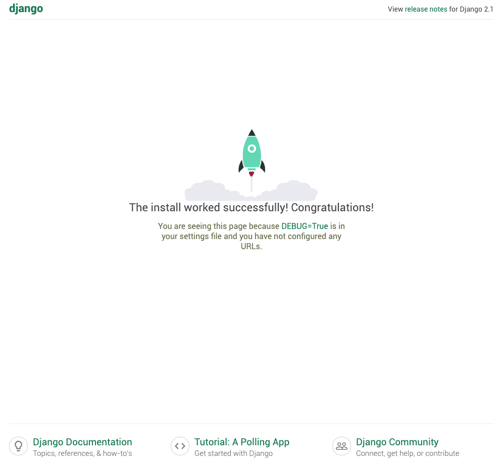

# Overview

In this blog, I will introduce various concepts of the Django web framework by creating a simple website.
NOTE: This blog assume the reader has an understanding of HTML and Python 3.

## Installation

Official installation instructions can be found [here](https://www.djangoproject.com/download/). 

    pip install Django

To verify that ansible installed properly, run the following command:

    django-admin

Output:
```
Type 'django-admin help <subcommand>' for help on a specific subcommand.

Available subcommands:

[django]
    check
    compilemessages
    createcachetable
    dbshell
    diffsettings
    dumpdata
    flush
    inspectdb
    loaddata
    makemessages
    makemigrations
    migrate
    runserver
    sendtestemail
    shell
    showmigrations
    sqlflush
    sqlmigrate
    sqlsequencereset
    squashmigrations
    startapp
    startproject
    test
    testserver
Note that only Django core commands are listed as settings are not properly configured (error: Requested setting INSTALLED_APPS, but settings are not configured. You must either define the environment variable DJANGO_SETTINGS_MODULE or call settings.configure() before accessing settings.).
```

## Background

Django is a "high-level" Python Web framework that encourages rapid development and clean, pragmatic design. Built by experienced developers, it takes care of much of the hassle of Web development, so you can focus on writing your app without needing to reinvent the wheel. It’s free and open source.

Django uses the [Model-View-Controller pattern (MVC)](https://realpython.com/the-model-view-controller-mvc-paradigm-summarized-with-legos/). The following files will be associated with this MVC pattern in Django:

    Model: models.py
    View: views.py
    Controller: urls.py

## Let's start!

Basic setup
---

Django considers all websites to be a collection of apps. For instance, Django would consider a forum, shop and blog within a website each its own app. To start a new project called `mysite`, run the following command:

    django-admin startproject <mysite>


The startproject command will create five files, a new folder and an app called mysite.

Files and folders structure:

```
├── mysite 
│   ├── manage.py   
│   └── mysite 
│       ├── __init__.py
│       ├── settings.py
│       ├── urls.py
│       ├── wsgi.py

manage.py   - A helper python script for django-admin. 
__init__.py - A Python package.
settings.py - This holds website settings like database configuration details.
urls.py     - This holds links in your project and the function(s).
wsgi.py     - This deploys our project over WSGI and helps the app communicate with the webserver. WSGI stands for Web Server Gateway Interface.
```

Let's see what the website looks like by run the following command:

    python manage.py runserver

NOTE: runserver - starts a lightweight development Web server on the local machine. By default, the server runs on port 8000 on the IP address 127.0.0.1. You can pass in an IP address and port number explicitly.

Output

```
Performing system checks...

System check identified no issues (0 silenced).

You have 15 unapplied migration(s). Your project may not work properly until you apply the migrations for app(s): admin, auth, contenttypes, sessions.
Run 'python manage.py migrate' to apply them.

February 13, 2019 - 15:25:43
Django version 2.1.7, using settings 'mysite.settings'
Starting development server at http://127.0.0.1:8000/
Quit the server with CONTROL-C.
```

For now, we can ignore the migration(s) message, we will address it later on. We can see that our development server is now running at http://127.0.0.1:8000. Open a browser and head to that address where you should see the default webpage as follows:



A place to call our own
---

Now we know Django is working, let's replace the default stuff with our own stuff.

Use `manage.py` to create another app called main. To start a new app call `main`, run the following command:

    python manage.py startapp main

Files and folders structure:

```
├── mysite 
│   ├── manage.py   
│   ├── mysite 
│   │   ├── __init__.py
│   │   ├── settings.py
│   │   ├── urls.py
│   │   └── wsgi.py
│   └── main 
│       ├── __init__.py
│       ├── admin.py
│       ├── apps.py
│       ├── models.py
│       ├── tests.py
│       ├── views.py
│       ├── migrations
│           ├── __init__.py

Migrations  - This holds another __init__.py file.
__init__.py - This is a Python package.
admin.py    - This lets us make the app modifiable in the admin interface.
apps.py     - This holds the names of all your applications.
models.py   - This holds all application models.
tests.py    - This holds unit tests for the project.
views.py    - This holds the application views for the project.
```

Let's start things off easy and change the homepage to display our own text message. To do this, we don't need a model, but we do need the view (text message to display) and the controller to point to the view, based on the URL. 

We need to tell Django that homepage should return some view. Django begins in the mysite app when looking for URLs. 

mysite/mysite/urls.py:

```
"""mysite URL Configuration

The `urlpatterns` list routes URLs to views. For more information please see:
    https://docs.djangoproject.com/en/2.1/topics/http/urls/
Examples:
Function views
    1. Add an import:  from my_app import views
    2. Add a URL to urlpatterns:  path('', views.home, name='home')
Class-based views
    1. Add an import:  from other_app.views import Home
    2. Add a URL to urlpatterns:  path('', Home.as_view(), name='home')
Including another URLconf
    1. Import the include() function: from django.urls import include, path
    2. Add a URL to urlpatterns:  path('blog/', include('blog.urls'))
"""
from django.contrib import admin
from django.urls import path

urlpatterns = [
    path('admin/', admin.site.urls),
]
```

The default settings for mysite/mysite/urls.py is an admin page found in the urlpatterns.  We need to include our main app's urls.py (which we will create shortly) to let Django know when the path is empty (the homepage) to check if main app's urls.py points to a view, which would be some function inside of main app's views.py.

new mysite/mysite/urls.py:

```
"""mysite URL Configuration

The `urlpatterns` list routes URLs to views. For more information please see:
    https://docs.djangoproject.com/en/2.1/topics/http/urls/
Examples:
Function views
    1. Add an import:  from my_app import views
    2. Add a URL to urlpatterns:  path('', views.home, name='home')
Class-based views
    1. Add an import:  from other_app.views import Home
    2. Add a URL to urlpatterns:  path('', Home.as_view(), name='home')
Including another URLconf
    1. Import the include() function: from django.urls import include, path
    2. Add a URL to urlpatterns:  path('blog/', include('blog.urls'))
"""
from django.contrib import admin
from django.urls import path, include

urlpatterns = [
    path('', include('main.urls')),
    path('admin/', admin.site.urls),
]
``` 

Beside importting `include` from django.urls, [path() function](https://docs.djangoproject.com/en/2.0/ref/urls/) is introduce in the urlpatterns. In short, this function tells urlpatterns either to include other paths from other apps (which we did above) or the function in views.p to associate with the url.

Create mysite/main/urls.py with the following content:

```
from django.urls import path
from . import views


app_name = 'main'  # namespacing of urls

urlpatterns = [
    path('', views.homepage, name='homepage'),
]
```
NOTE: We specify the app name (which isn't required) as it might become very useful when we want to dynamically reference URLs.

Okay, great! We've got the controller all set. When someone visits the homepage, Django looks first at the mysite/mysite/urls.py, seeing that it points to mysite/main/urls.py, which then points to views.homepage (a function called homepage inside of mysite/main/views.py).


The mysite/main/views.py file is automatically creared with the following conent:

```
from django.shortcuts import render

# Create your views here.

```

Normally, these views will render some HTML template and pass some variables, but we will keep it simple and return a HTTP response.

Add the following content to mysite/main/views.py:

```
from django.shortcuts import render
from django.http import HttpResponse

# Create your views here.
def homepage(request):
    return HttpResponse("<strong>Numerator is AwSoMe!!!</strong>")

```

Now, restart the server (python manage.py runserver), refresh the browser (@ http://127.0.0.1:8000/) and have a look see.

## Model

A model is the single, definitive source of information about your data. It contains the essential fields and behaviors of the data you’re storing. Generally, each model maps to a single database table.

The basics:

    Each model is a Python class that subclasses django.db.models.Model
    Each attribute of the model represents a database field
    With all of this, Django gives you an automatically-generated database-access API -> [Making queries](https://docs.djangoproject.com/en/2.1/topics/db/queries/)

Let us setup an example model based around a blog.  First, we will need to thing thing up a list of attributes we would want to associated with a blog.  The list of attributes would translate to fields in database.  At this point, it is not necessary to come up with an exhaustive list of attributes as one can easily add more at a later time.  For now, our list will be made up of the following attributes: content, title and published.


The mysite/main/models.py file is automatically creared with the following conent:

```
from django.db import models

# Create your models here.

```

Add the following content to mysite/main/models.py:

```
from django.db import models

# Create your models here.
class Blog(models.Model):
    blog_title = models.CharField(max_length=128)
    blog_content = models.TextField()
    blog_published = models.DateTimeField(verbose_name='Published Date', auto_now_add=True)

    def __str__(self):
        return self.blog_title


# For simplicity sake, we will create a blog entries within view to populate the database with some data
Blog.objects.create(
    blog_title = 'Vagrant for dummies'
    blog_content = 'In this blog, I will describe how to setup and teardown Vagrant locally on MacOS and AWS...'
)


Blog.objects.create(
    blog_title = 'Terraform Basics'
    blog_content = 'In this blog, I will describe some fundamentals concepts of Terraform...'
)


Blog.objects.create(
    blog_title = 'D is for Django'
    blog_content = 'In this blog, I will introduce various concepts of the Django web framework by creating a simple website...'
)
```

NOTE: For information on [django model fields documentation](https://docs.djangoproject.com/en/2.1/ref/models/fields/)

If this is a new app, the following step are required:

The mysite/mysite/settings.py file is automatically creared with the following conent:

```
"""
Django settings for mysite project.

Generated by 'django-admin startproject' using Django 2.1.7.

For more information on this file, see
https://docs.djangoproject.com/en/2.1/topics/settings/

For the full list of settings and their values, see
https://docs.djangoproject.com/en/2.1/ref/settings/
"""

import os

# Build paths inside the project like this: os.path.join(BASE_DIR, ...)
BASE_DIR = os.path.dirname(os.path.dirname(os.path.abspath(__file__)))


# Quick-start development settings - unsuitable for production
# See https://docs.djangoproject.com/en/2.1/howto/deployment/checklist/

# SECURITY WARNING: keep the secret key used in production secret!
SECRET_KEY = 'p04bzgnnef@o(3d1tkd)hi(vf-j(9lyuyrp_xe=tb^9gr^^as6'

# SECURITY WARNING: don't run with debug turned on in production!
DEBUG = True

ALLOWED_HOSTS = []


# Application definition

INSTALLED_APPS = [
    'django.contrib.admin',
    'django.contrib.auth',
    'django.contrib.contenttypes',
    'django.contrib.sessions',
    'django.contrib.messages',
    'django.contrib.staticfiles',
]

MIDDLEWARE = [
    'django.middleware.security.SecurityMiddleware',
    'django.contrib.sessions.middleware.SessionMiddleware',
    'django.middleware.common.CommonMiddleware',
    'django.middleware.csrf.CsrfViewMiddleware',
    'django.contrib.auth.middleware.AuthenticationMiddleware',
    'django.contrib.messages.middleware.MessageMiddleware',
    'django.middleware.clickjacking.XFrameOptionsMiddleware',
]

ROOT_URLCONF = 'mysite.urls'

TEMPLATES = [
    {
        'BACKEND': 'django.template.backends.django.DjangoTemplates',
        'DIRS': [],
        'APP_DIRS': True,
        'OPTIONS': {
            'context_processors': [
                'django.template.context_processors.debug',
                'django.template.context_processors.request',
                'django.contrib.auth.context_processors.auth',
                'django.contrib.messages.context_processors.messages',
            ],
        },
    },
]

WSGI_APPLICATION = 'mysite.wsgi.application'


# Database
# https://docs.djangoproject.com/en/2.1/ref/settings/#databases

DATABASES = {
    'default': {
        'ENGINE': 'django.db.backends.sqlite3',
        'NAME': os.path.join(BASE_DIR, 'db.sqlite3'),
    }
}


# Password validation
# https://docs.djangoproject.com/en/2.1/ref/settings/#auth-password-validators

AUTH_PASSWORD_VALIDATORS = [
    {
        'NAME': 'django.contrib.auth.password_validation.UserAttributeSimilarityValidator',
    },
    {
        'NAME': 'django.contrib.auth.password_validation.MinimumLengthValidator',
    },
    {
        'NAME': 'django.contrib.auth.password_validation.CommonPasswordValidator',
    },
    {
        'NAME': 'django.contrib.auth.password_validation.NumericPasswordValidator',
    },
]


# Internationalization
# https://docs.djangoproject.com/en/2.1/topics/i18n/

LANGUAGE_CODE = 'en-us'

TIME_ZONE = 'UTC'

USE_I18N = True

USE_L10N = True

USE_TZ = True


# Static files (CSS, JavaScript, Images)
# https://docs.djangoproject.com/en/2.1/howto/static-files/

STATIC_URL = '/static/'
```

Whenever we add a new app, we need to "install" the app.  

In mysite/mysite/settings.py and add 'main.apps.MainConfig', to INSTALLED_APPS as follows:

```
INSTALLED_APPS = [
    'main.apps.MainConfig',
    'django.contrib.admin',
    'django.contrib.auth',
    'django.contrib.contenttypes',
    'django.contrib.sessions',
    'django.contrib.messages',
    'django.contrib.staticfiles',
]
```

Migrations are Django’s way of propagating changes you make to your models (adding a field, deleting a model, etc.) into your database schema. 

To add a new model or change an existing model, the following steps are required:

Prepare the migration,

    python manage.py makemigrations

Output:

```
Migrations for 'main':
  main/migrations/0001_initial.py
    - Create model Blog
```

Apply the migration,

    python manage.py migrate

NOTE: For information on [Migrations](https://docs.djangoproject.com/en/2.1/topics/migrations/)

Output:

```
Operations to perform:
  Apply all migrations: admin, auth, contenttypes, main, sessions
Running migrations:
  Applying contenttypes.0001_initial... OK
  Applying auth.0001_initial... OK
  Applying admin.0001_initial... OK
  Applying admin.0002_logentry_remove_auto_add... OK
  Applying admin.0003_logentry_add_action_flag_choices... OK
  Applying contenttypes.0002_remove_content_type_name... OK
  Applying auth.0002_alter_permission_name_max_length... OK
  Applying auth.0003_alter_user_email_max_length... OK
  Applying auth.0004_alter_user_username_opts... OK
  Applying auth.0005_alter_user_last_login_null... OK
  Applying auth.0006_require_contenttypes_0002... OK
  Applying auth.0007_alter_validators_add_error_messages... OK
  Applying auth.0008_alter_user_username_max_length... OK
  Applying auth.0009_alter_user_last_name_max_length... OK
  Applying main.0001_initial... OK
  Applying main.0002_auto_20190214_1920... OK
  Applying sessions.0001_initial... OK
```

## Views and Templates

A view function, or view for short, is simply a Python function that takes a Web request and returns a Web response. This response can be the HTML contents of a Web page, or a redirect, or a 404 error, or an XML document, or an image . . . or anything, really. The view itself contains whatever arbitrary logic is necessary to return that response. This code can live anywhere you want, as long as it’s on your Python path. There’s no other requirement–no “magic,” so to speak. For the sake of putting the code somewhere, the convention is to put views in a file called views.py, placed in your project or application directory.

To begin here, let's head into mysite/main/views.py and change our homepage function to

```
from django.shortcuts import render
from .models import Blog

# Create your views here.

def homepage(request):
    return render(request=request,
                  template_name='main/home.html',
                  context = {"blogs": Blog.objects.all})
```

Django looks for templates in each of your app's directories by seeking out any directory called "templates". So, let's make a new directory called templates at mysite/main/templates, then, inside of that, add another directory called main, so you will have mysite/main/templates/main/. Head there, and make a file inside called home.html. Now we can add some simple HTML here, along with our object as follows:

mysite/main/templates/main/home.html
```

<body>


    <p>{{blog.blog_title}}</p>
    <p>{{blog.blog_published}}</p>
    <p>{{blog.blog_content|safe}}</p>
    <br><br>


</body>

```

NOTE: Django has its own templating, which is *similar* to Jinja, but some things are indeed different.

Okay, save everything and let's check it out by visiting our homepage: http://127.0.0.1:8000/

<<Work in progress>>


