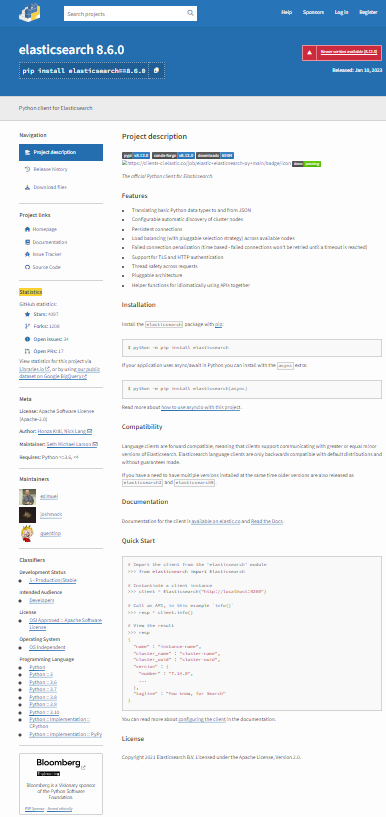
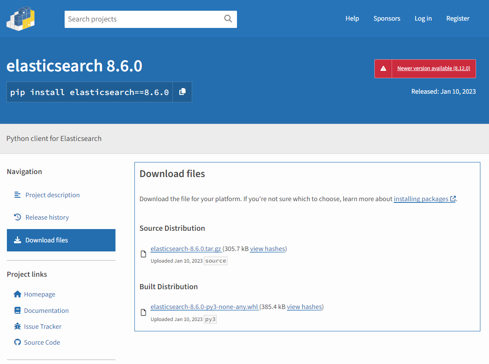

# Overview

Companies are realizing their data is one of the most valuable resources they own.  I have seen a movement towards private clouds or going back to bare metal servers to host the applications.  Furthermore, to fully protect themselves from external attack, many companies have restricted internet connectivity for all their servers and workstations.  Where this becomes an issue for me is that files must be download to some secure media which goes through a security scan before it is uploaded to any servers and / or workstations.  

In this blog, I will look into the specific issue of installing Python packages offline where the following proposed solution worked for my situation.

# TL;DR: Solution

A solution I have adopted was to download the Python package(s) (and its dependencies) to the secure media and then uploading these package(s) to a folder onto the servers and / or workstations then installing these packages using `pip` to pointing to the location of these package(s).

# How to download a Python package

Navigate to the PyPI website and search for the package(s) you want to install.  In the following example, I will use the Python client for Elasticsearch version 8.6.0. 


From here, click on the ‘Download files’ link. It will bring you to the following page.


There are two files that can be downloaded. One is a Python wheel file and the other is a tarball (both are zip files). Here the tarball is the source and wheel is the distribution of the package for faster and more stable installation. We can use either of these files to install the package, but the preferable one is the wheel.

# How to Figure Out the Dependencies?

## requirements file

Downloaded the source (tarball) and search for files like `requires.txt` or `requirements.txt`.  Download the wheel file for these dependencies. 

## Trial and error

Try to install the package and if there are dependencies, the install will fail.  Note these dependencies and download their wheel file.

# Installing a Python package offline

With pip, we can point to these wheel files to install the package with the following command:

```
pip install --no-index --find-links=<local-folder> <package-name>
```

Example with Elasticsearch version 8.6.0: 
```
pip install --no-index --find-link=/files/python-wheels elasticsearch==8.6.0
```

When we run pip install as above then it avoids searching in PyPI (because of no-index option) and instead try to find and install the package and its dependencies from find-links folder location.

In order for pip to install the package successfully, the find-links location need to have the package and its dependencies.

# Conclusion

Although it may be cumbersome to track down all the packages' dependencies, `pip` provides a solution to install Python packages and their dependencies offline
