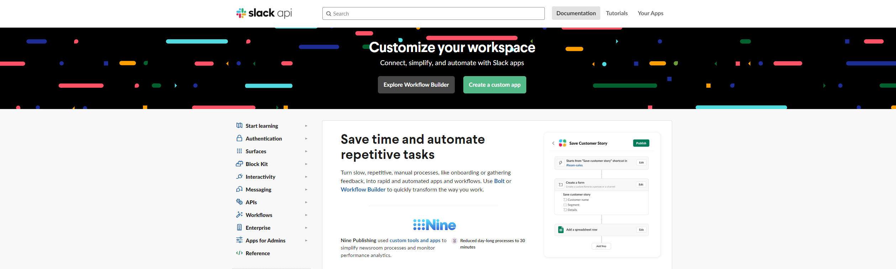
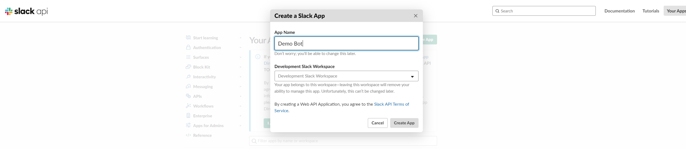
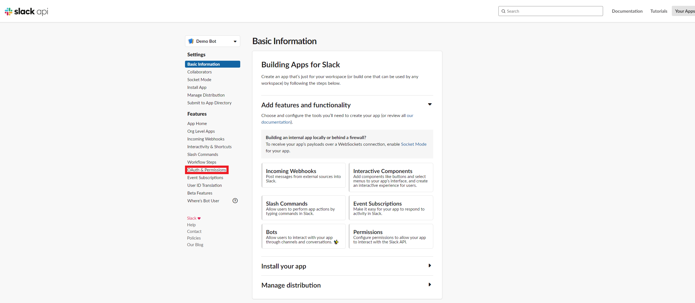
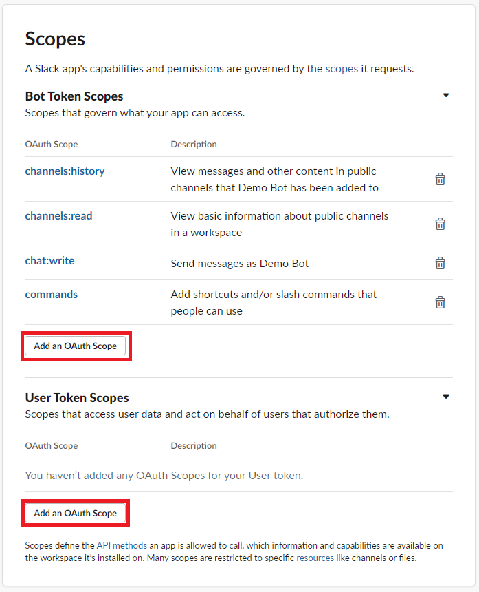
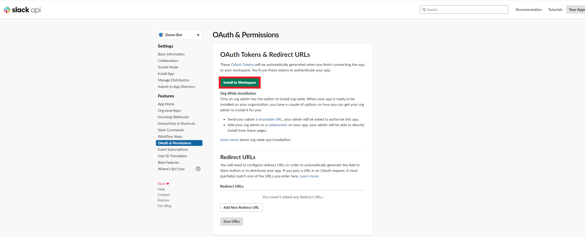
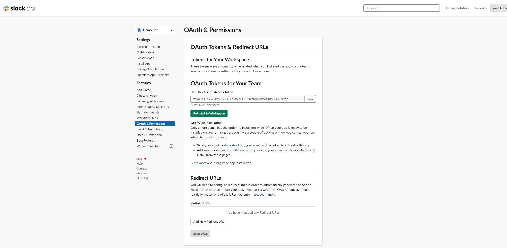

# How to create a Slack application

In this blog, I will explain how to create a Slack APP to get the coveted OAuth Token prize.

## Create a Slack App

1. Sign into your Slack workspace
2. Navigate to [Slack API](https://api.slack.com)
3. Select `Create a custom app`

4. Enter a name for your App
5. Select a Slack workspace for your App

6. Select `OAuth & Permissions` to create the scope of the App

7. Add the capabilities and permissisons for the App

8. Once you have added all the scopes for the App, install the App to a workspace

9. Review the capabilities and permissisons for the App and select `Allow`

10. At this point, you have reached the achievement `OAuth Token` and may start developing your App

11. Don't forget to add your App to the channel(s) you want to reak havoc to!

# Conclusion

Now you know how to created an Slack App, the real fun start.
